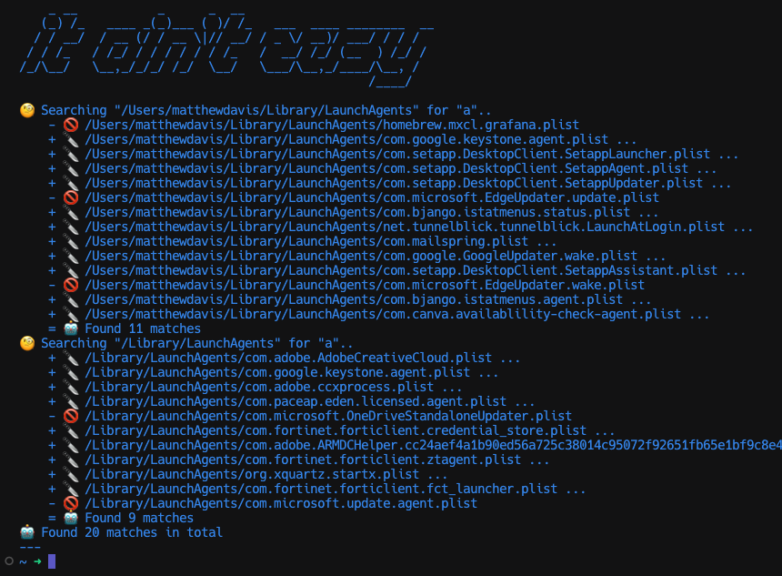

# osx startup cleaner



### Listing launchctl services

Show all launchctl services:

```bash
launchctl list
```

Show only running services:

```bash
launchctl list | grep -v -
```

### Checking plist files

```bash
plutil /Library/LaunchAgents/com.paceap.eden.licensed.agent.plist

/Library/LaunchAgents/com.paceap.eden.licensed.agent.plist: OK
```
